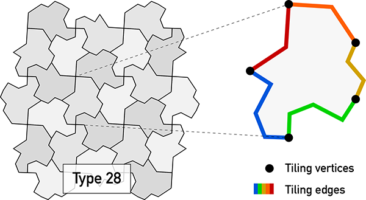
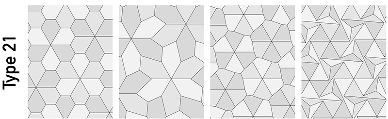
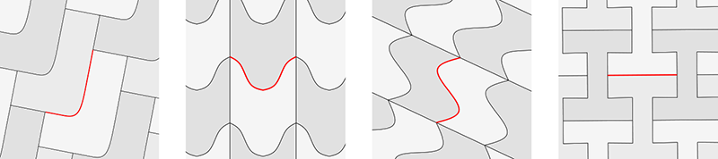

# TactileJS
TactileJS is a Javascript library for representing, manipulating, and drawing tilings of the plane.  The tilings all belong to a special class called the _isohedral tilings_. Every isohedral tiling is formed from repeated copies of a single shape, and the pattern of repetition is fairly simple. At the same time, isohedral tilings are very expressive (they form the basis for a lot of the tessellations created by M.C. Escher) and efficient to compute.

I created the first versions of Tactile in the late 1990s, while working on my [PhD][phd].  This Javascript library is a port of the analogous [C++ library][tactile] I created as a modern upgrade of the original Tactile. The core library is completely self-contained; I also provide a demo based on Tactile, [`P5.js`][p5js], and [`QuickSettings`][quickset] (which are included in `demo/` for convenience). Of course, the goal is not simply to use the demo page as-is, but rather to explore new applications of the library in an interactive web-based context.

The rest of the documentation below is a translation into Javascript of the corresponding documentation on the [Tactile][tactile] library page. You can also peruse the source code in `demo/`, which uses the library to develop a couple of simple interactive and non-interactive drawing programs.  You can also [try the demo][demo] online.

## A crash course on isohedral tilings

In order to understand how to use Tactile, it might first be helpful to become acquainted with the Isohedral tilings.  The ultimate reference on the subject is the book _Tilings and Patterns_ by Grünbaum and Shephard.  You could also have a look at my book, [_Introductory Tiling Theory for Computer Graphics_][mybook], which is much slimmer and written more from a computer science perspective.  If you want a quick and free introduction, you could look through Chapters 2 and 4 of [my PhD thesis][phd].

Every isohedral tiling is made from repeated copies of a single shape called the _prototile_, which repeats in a very orderly way to fill the plane. We can describe the prototile's shape by breaking it into _tiling edges_, the shared boundaries between adjacent tiles, which connect at _tiling vertices_, the points where three or more tiles meet.

<p align="center"></p>

There are 93 "tiling types", different ways that tiles can relate to each other. Of these, 12 are boring for reasons I won't talk about here; this library lets you manipulate the other 81 types.

For each isohedral tiling type, there are constraints on the legal relationships between the tiling vertices.  Those constraints can be encoded in a set of _parameters_, which are just real numbers.  Some tiling types have zero parameters (their tiling vertices must form a fixed shape, like a square or a hexagon); others have as many as six free parameters.

<p align="center"></p>

## Loading the library

Tactile is delivered as an ES6 module, which you should access from your Javascript code using an `import` statement.  For example:

```Javascript
import { EdgeShape, numTypes, tilingTypes, IsohedralTiling } 
	from './tactile.js';
```

See the `demo/` folder for more examples.

## Constructing a tiling

The class `IsohedralTiling` can be used to describe a specific tiling and its prototile.  It has a single constructor that takes the desired tiling type as an argument.  The tiling type is expressed as an integer representing a legal isohedral type.  These are all numbers between 1 and 93 (inclusive), but there are some holes—for example, there is no Type 19.  The array `tilingTypes`, with length `numTypes` (fixed at 81) contains the legal types:

```Javascript
// Suppose you wanted to loop over all the tiling types...
for( let idx = 0; idx < numTypes; ++idx ) {
    // Create a new tiling of the given type, with default shape.
    let a_tiling = new IsohedralTiling( tilingTypes[ idx ] );
    // Do something with this tiling type
}
```

## Controlling parameters

You can get and set the parameters that control the positions of the tiling vertices through an array of floating point numbers:

```Javascript
// Get the current values of the parameters.
let params = a_tiling.getParameters();
if( a_tiling.numParameters() > 1 ) {
    params[ 1 ] += 1.0;
    // Send the parameters back to the tiling
    a_tiling.setParameters( params );
}
```

Setting the parameters causes a lot of internal data to be recomputed (efficiently, but still), which is why all parameters should be set together in one function call.

## Prototile shape

As discussed above, a prototile's outline can be thought of as a sequence of tiling edges running between consecutive tiling vertices. Of course, in order to tile the plane, some of those edges must be transformed copies of others, so that a tile can interlock with its neighbours.  In most tiling types, then, there are fewer distinct _edge shapes_ than there are edges, sometimes as few as a single path repeated all the way around the tile. Furthermore, some edge shapes can have internal symmetries forced upon it by the tiling: 

<p align="center"></p>

 * Some edges must look the same after a 180° rotation, like a letter S.  We call these **S** edges.
 * Some edges must look the same after reflecting across their length, like a letter U.  We call these **U** edges.
 * Some edges must look the same after both rotation _and_ reflection. Only a straight line has this property, so we call these **I** edges.
 * All other edges can be a path of any shape.  We call these **J** edges.
 
Tactile assumes that an edge shape lives in a canonical coordinate system, as a path that starts at (0,0) and ends at (1,0). The library will then tell you the transformations you need to perform in order to map those canonical edges into position around the prototile's boundary. You can access this information by looping over the tiling edges using a C++ iterator:

```Javascript
// Iterate over the tiling's edges, getting information about each edge
for( let i of a_tiling.shape() ) {
    // Determine which canonical edge shape to use for this tiling edge.
    // Multiple edges will have the same ID, indicating that the edge shape is
    // reused multiple times.
    const id = i.id;
    // Get a transformation matrix (as an array of six numbers, representing
    // the first two rows of a 3x3 matrix) that moves the edge from canonical
    // position into its correct place around the tile boundary.
    const T = i.T;
    // Get the intrinsic shape constraints on this edge shape: Is it
    // J, U, S, or I?  Here, it's your responsibility to draw a path that
    // actually has those symmetries.
    const shape = i.shape;
    // When edges interlock, one copy must be parameterized backwards 
    // to fit with the rest of the prototile outline.  This boolean
    // tells you whether you need to do that.
    const rev = i.rev;
    
    // Do something with the information above...
}
```

<p align="center"></p>

Javascript doesn't include functions for linear algebra. For what it's worth, TactileJS includes a function `mul` which understands how to multiply 2D transformation matrices together (as might be offered to you in a shape iterator's `T` field above), and how to transform a point (represented as a Javascript object with fields `x` and `y`) using a transformation matrix.

Occasionally, it's annoying to have to worry about the **U** or **S** symmetries of edges yourself.  Tactile offers an alternative way to describe the tile's outline that includes extra steps that account for these symmetries.  In this case, the transformation matrices build in scaling operations that map a path from (0,0) to (1,0) to, say, each half of an **S** edge separately.  The correct approach here is to iterate over a tile's `parts()` rather than its `shape()`:

```C++
// Iterate over the tiling's edges, getting information about each edge
for( let i of a_tiling.parts() ) {
    // As above.
    const id = i.id;
    // As above for J and I edges.  For U and S edges, include a scaling
    // operation to map to each half of the tiling edge in turn.
    const T = i.T;
    // As above
    const shape = i.shape;
    // As above
    const rev = i.rev;
    // For J and I edges, this is always false.  For U and S edges, this
    // will be false for the first half of the edge and true for the second.
    const second = i.second;
    
    // Do something with the information above...
}
```

When drawing a prototile's outline using `parts()`, a **U** edge's midpoint might lie anywhere on the perpendicular bisector of the line joining two tiling vertices. For that reason, you are permitted to make an exception and have the underlying canonical path end at (1,_y_) for any _y_ value.

Note that there's nothing in the description above that knows how paths are represented. That's a deliberate design decision that keeps the library lightweight and adaptable to different sorts of curves.  It's up to you to maintain a set of canonical edge shapes that you can transform and string together to get the final tile outline. 

## Laying out tiles

The core operation of tiling is to fill a region of the plane with copies of the prototile.  Tactile offers a simple iterator-based approach for doing this:

```Javascript
// Fill a rectangle given its bounds (xmin, ymin, xmax, ymax)
for( let i of a_tiling.fillRegionBounds( 0.0, 0.0, 8.0, 5.0 ) ) {
    // Get the 3x3 matrix corresponding to one of the transformed
    // tiles in the filled region.
    const T = i.T;
    // Use a simple colouring algorithm to pick a colour for this tile
    // so that adjacent tiles aren't the same colour.  The resulting
    // value col will be 0, 1, or 2, which you should map to your
    // three favourite colours.
    const col = a_tiling.getColour( i.t1, i.t2, i.aspect );
}
```

There is an alternative form `fillRegionQuad()` that takes four points as arguments instead of bounds.

The region filling algorithm isn't perfect.  It's difficult to compute exactly which tiles are needed to fill a given rectangle, at least with high efficiency.  It's possible you'll generate tiles that are completely outside the window, or leave unfilled fringes at the edge of the window.  The easiest remedy is to fill a larger region than you need and ignore the extra tiles.  In the future I may work on improving the algorithm, perhaps by including an option that performs the extra computation when requested.

## Other versions

 * [Tactile][tactile], my original C++ version of this library.
 * [Tactile-rs][tactilers], a Rust port by Antoine Büsch
 * [Tactile-python][tactilepy], a Python port by David Braun
 
## In closing

I hope you find this library to be useful.  If you are using Tactile for research, for fun, or for commercial products, I would appreciate it if you'd let me know.  I'd be happy to list projects based on Tactile here, and it helps my research agenda to be able to say that the library is getting used.  Thank you.

## In closing

I hope you find this library to be useful.  If you are using Tactile for research, for fun, or for commercial products, I would appreciate it if you'd let me know.  I'd be happy to list projects based on Tactile here, and it helps my research agenda to be able to say that the library is getting used.  Thank you.

[phd]: https://cs.uwaterloo.ca/~csk/other/phd/
[p5js]: https://p5js.org/
[quickset]: https://github.com/bit101/quicksettings
[tactile]: https://github.com/isohedral/tactile
[demo]: http://isohedral.ca/software/tactile/
[mybook]: https://www.amazon.com/Introductory-Computer-Graphics-Synthesis-Animation/dp/1608450171
[tactilers]: https://github.com/abusch/tactile-rs
[tactilepy]: https://github.com/DBraun/tactile-python
